<div align="center">

# 🔩 Schraubwerk CRM

### Kundenbeziehungsmanagement für den Großhandel mit Verbindungselementen

Windows-Desktop-Anwendung mit **C#**, **WPF / Windows Forms** und **Entity Framework 6** – entwickelt von **Amir Reza Afshar**.


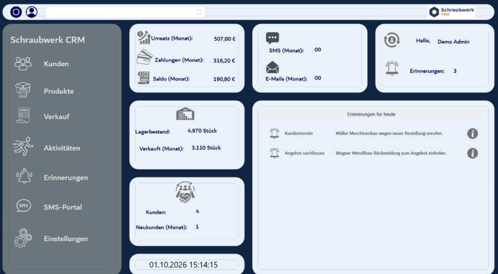

</div>

---

## 📑 Inhalt

- [Über das Projekt](#-über-das-projekt)
- [Demo ausprobieren](#-demo-ausprobieren)
- [Funktionen](#-funktionen)
- [Screenshots](#️-screenshots)
- [Architektur](#️-architektur)
- [Technologien](#-technologien)
- [Für Entwickler: Projekt starten](#-für-entwickler-projekt-starten)
- [Installationspaket erstellen](#-installationspaket-erstellen)
- [Kontakt](#-kontakt)

---

## 💡 Über das Projekt

Schraubwerk CRM wurde für einen Großhändler für **Verbindungselemente** (Schrauben, Muttern, Scheiben, Dübel) entwickelt.
Es bündelt die tägliche Arbeit an einem Ort: Kunden und Produkte verwalten, Verkäufe erfassen, Rechnungen drucken,
Zahlungen buchen und Aufgaben an Mitarbeitende verteilen – geschützt durch Benutzerrollen mit feinen Rechten.

Die vorliegende Version ist eine **Demo-Version**: Beim ersten Start legt das Programm Datenbank, gespeicherte Prozeduren,
Benutzer und Beispieldaten selbst an. Es ist keine Lizenz und keine Datenbank-Einrichtung nötig.

---

## 🚀 Demo ausprobieren

1. Unter **[Releases](../../releases)** die Datei **`SchraubwerkCRM-Demo-Setup.zip`** herunterladen und entpacken.
2. **`Installieren.cmd`** doppelklicken.
   - Fehlt *SQL Server Express LocalDB*, wird es automatisch von Microsoft geladen und installiert (einmalig Administratorrechte).
   - Das Programm wird nach `%LOCALAPPDATA%\Programs\SchraubwerkCRM` kopiert, Verknüpfungen landen auf dem Desktop und im Startmenü.
3. Das Programm startet automatisch – **Benutzer `demo` / Passwort `demo123`** sind bereits eingetragen.

| Benutzer | Passwort | Rolle |
|---|---|---|
| `demo` | `demo123` | Admin – alle Rechte |
| `m.schulz` | `demo123` | Vertrieb – eingeschränkte Rechte (kein Löschen, keine Benutzerverwaltung) |

> Voraussetzungen: Windows 10/11, .NET Framework 4.7.2 (in Windows 10/11 enthalten).
> Warnt Windows SmartScreen, auf **„Weitere Informationen“ → „Trotzdem ausführen“** klicken (das Programm ist nicht signiert).
> Deinstallation über **Startmenü → Schraubwerk CRM → deinstallieren**.

---

## ✨ Funktionen

| Modul | Beschreibung |
|---|---|
| 📊 **Startseite** | Umsatz, Zahlungen und Saldo des Monats, Lagerbestand, verkaufte Stück, Kunden und Erinnerungen für heute |
| 🏢 **Kunden** | Anlegen, bearbeiten, löschen und durchsuchen – jeder Kunde hat einen Betreuer |
| 📦 **Produkte** | Verbindungselemente mit Gewinde, Länge, Güte, Überzug, DIN-Nummer, Preis, Bestand und Produktbild |
| 🛒 **Verkauf** | Kunde wählen → Warenkorb füllen (Rabatt/Gewinn optional) → Bestellung anlegen → Rechnung drucken; Lagerbestand wird automatisch reduziert |
| 💶 **Zahlungen** | Teil- und Restzahlungen je Rechnung buchen, offene Beträge auf einen Blick |
| 📞 **Aktivitäten** | Telefonate, Besuche, Angebote usw. je Kunde dokumentieren, optional mit Erinnerung |
| ⏰ **Erinnerungen** | Aufgaben einem Benutzer zuweisen – sie erscheinen am Fälligkeitstag auf seiner Startseite |
| 🔐 **Benutzer & Rollen** | Rollen mit Rechten pro Bereich (Lesen, Anlegen, Bearbeiten, Löschen) |
| 🧭 **Bedienhinweise** | Jedes Fenster zeigt unten, was als Nächstes zu tun ist – im Verkauf Schritt für Schritt |
| 🖼️ **Bilder** | Hochgeladene Bilder werden automatisch verkleinert und als JPEG gespeichert (aus mehreren MB werden wenige KB) |

---

## 🖼️ Screenshots

### 🔑 Anmeldung & Startseite

| Anmeldung | Startseite |
|---|---|
| 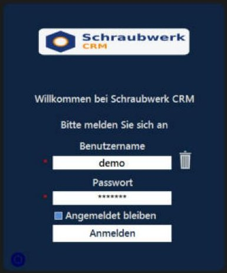 |  |

### 🏢 Kunden & 📦 Produkte

| Kunden | Produkte |
|---|---|
| 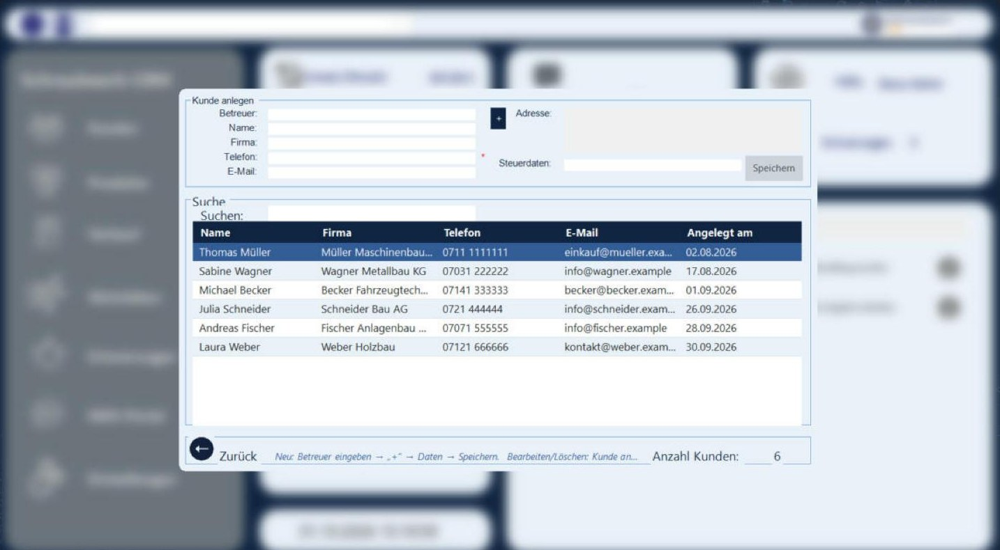 | 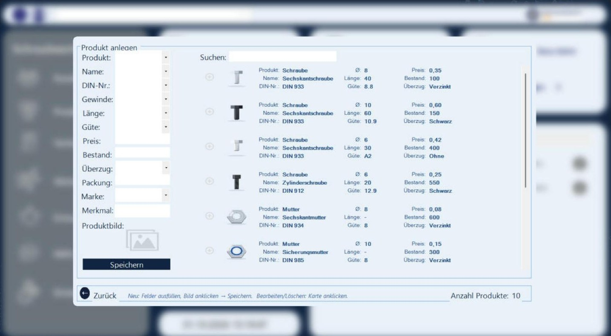 |

### 🛒 Verkauf & 💶 Zahlung

| 1. Kunde auswählen | 2. Warenkorb & Bestellung |
|---|---|
| 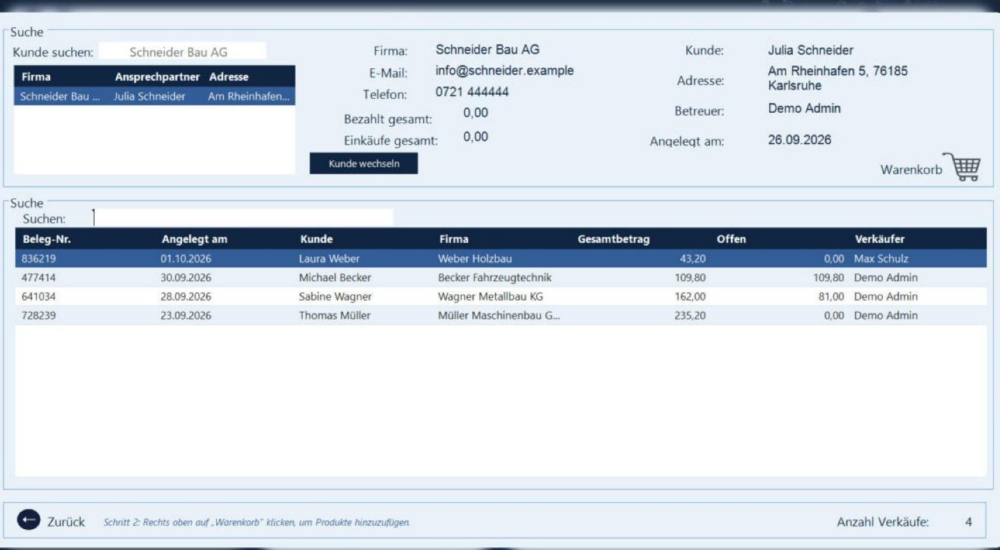 | 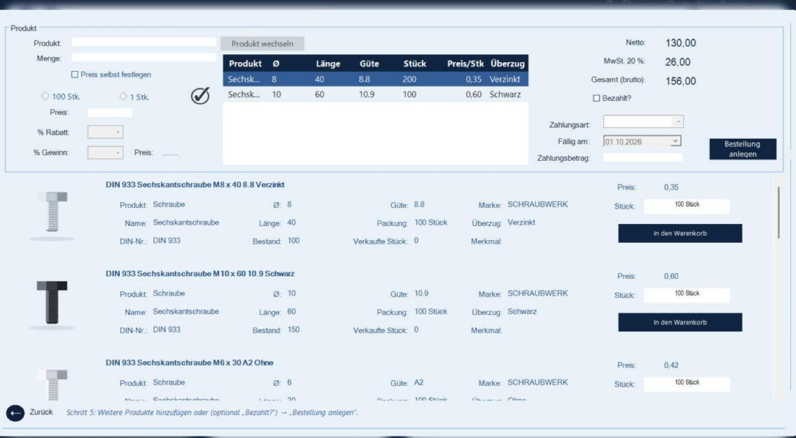 |

| Zahlung erfassen |
|---|
| 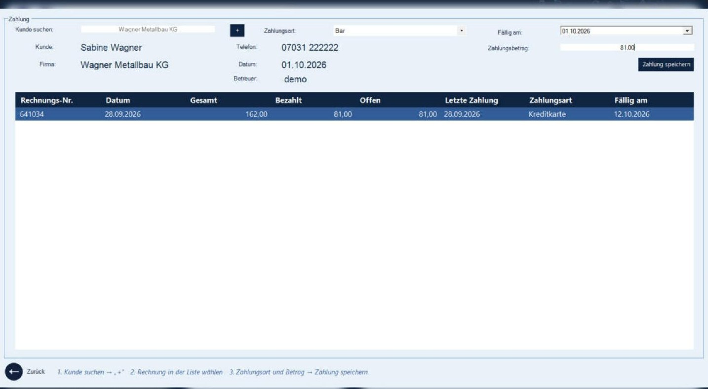 |

### 📞 Aktivitäten & ⏰ Erinnerungen

| Aktivitäten | Erinnerungen |
|---|---|
| 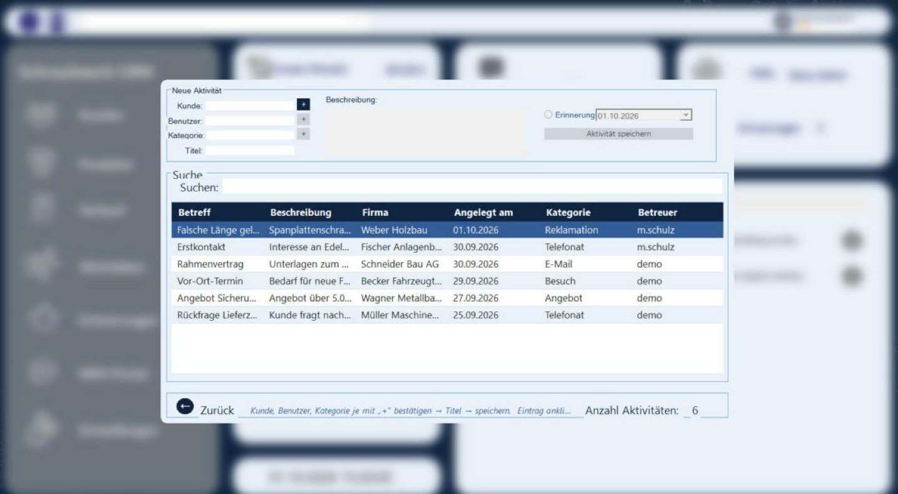 | 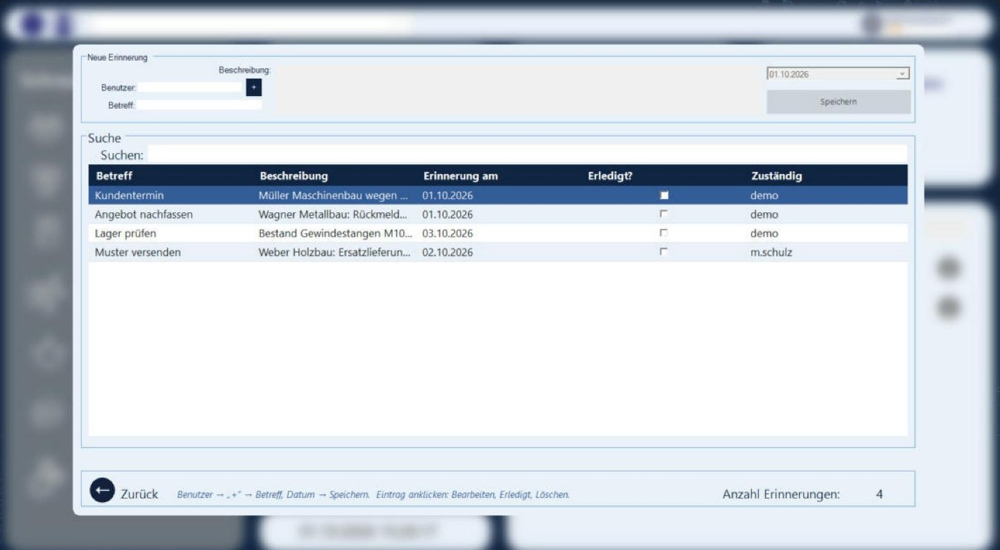 |

### 🔐 Benutzer & Rollen

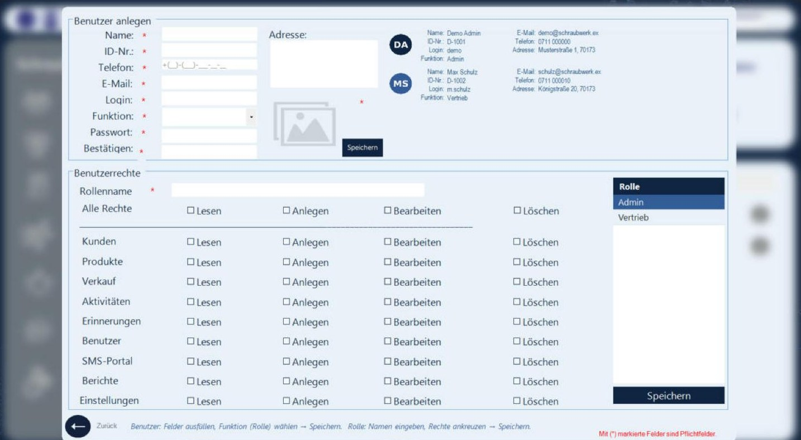

---

## 🏗️ Architektur

Die Anwendung ist in drei Schichten plus Entitäten aufgeteilt:

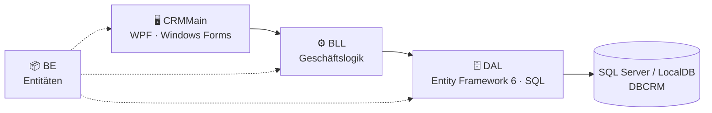

```
CRMProject.sln
├── BE/            Entitäten (Kunde, Produkt, Rechnung, Benutzer, Erinnerung …)
├── DAL/           DbContext, Migrationen, Datenzugriff (EF 6 + gespeicherte Prozeduren)
├── BLL/           Geschäftslogik
├── CRMMain/       Desktop-Oberfläche (WPF und Windows Forms), Bilder, App.config
│   ├── Compat/    Demo-Einrichtung, Rechnungsdruck, Design, Bild- und Tabellen-Hilfen, Bedienhinweise
│   └── Setup/     Demo-Produktbilder (werden mit dem Programm ausgeliefert)
├── SQL Process/   Gespeicherte Prozeduren (_Alle_Prozeduren.sql)
├── Installer/     Skripte für das Installationspaket (ZIP) und optional Inno Setup
└── screenshots/   Bilder für diese README
```

- Die Verbindungszeichenfolge steht an **einer Stelle**: `CRMMain/App.config` → Eintrag `constr`.
- `DemoMode=true` in `App.config` aktiviert die automatische Einrichtung (`CRMMain/Compat/DemoSetup.cs`):
  Datenbank anlegen, Prozeduren anlegen/aktualisieren, fehlende Demo-Daten ergänzen.
- Das Projekt kommt **ohne kommerzielle DLLs** aus: Die Rechnung wird als HTML-Seite erzeugt und im Browser zum Drucken oder Speichern als PDF geöffnet.

---

## 🧩 Technologien

| Bereich | Technologien |
|---|---|
| Sprache & Plattform | C#, .NET Framework 4.7.2 |
| Oberfläche | WPF mit [HandyControls](https://github.com/ghost1372/HandyControls), Windows Forms |
| Datenzugriff | Entity Framework 6 (Code First, Migrationen), ADO.NET mit gespeicherten Prozeduren |
| Datenbank | Microsoft SQL Server bzw. SQL Server Express LocalDB |

---

## 🛠 Für Entwickler: Projekt starten

**Voraussetzungen:** Windows und Visual Studio 2022/2026 mit der Workload **.NET-Desktopentwicklung** (enthält LocalDB).

1. Repository klonen und `CRMProject.sln` öffnen, **CRMMain** als Startprojekt festlegen.
2. Datenbankserver in `CRMMain/App.config` (`constr`) eintragen:
   - eigener SQL Server: `Data Source=.;Initial Catalog=DBCRM;Integrated Security=true` (Standard)
   - ohne SQL Server: `Data Source=(localdb)\MSSQLLocalDB;Initial Catalog=DBCRM;Integrated Security=true`
3. Programm starten (**F5**). Dank Demo-Modus werden Datenbank, Prozeduren und Beispieldaten automatisch angelegt.

Ohne Demo-Modus (`DemoMode=false`) wird die Datenbank wie gewohnt eingerichtet:
`Update-Database` in der Paket-Manager-Konsole (Standardprojekt **DAL**) und anschließend
`SQL Process/_Alle_Prozeduren.sql` in SQL Server Management Studio ausführen.

---

## 📦 Installationspaket erstellen

1. In Visual Studio die Konfiguration **Release** wählen und in `CRMMain/App.config` die LocalDB-Verbindung eintragen.
2. **Erstellen → Projektmappe neu erstellen**.
3. Den Inhalt von `CRMMain/bin/Release` (ohne `.pdb`/`.xml`) nach `Installer/Ausgabe/SchraubwerkCRM-Demo/App` kopieren,
   die Skripte aus `Installer/` daneben legen und den Ordner als ZIP packen.
4. Die ZIP-Datei als **GitHub-Release** hochladen.

Optional erzeugt `Installer/SchraubwerkCRM.iss` mit [Inno Setup](https://jrsoftware.org/isinfo.php) einen klassischen Setup-Assistenten (`setup.exe`).

---

## 📩 Kontakt

**Amir Reza Afshar** – Umschüler zum Fachinformatiker für Anwendungsentwicklung

- 🌐 Portfolio: [amirrezaafshar.de](https://amirrezaafshar.de)
- ✉️ E-Mail: [info@amirrezaafshar.de](mailto:info@amirrezaafshar.de)
- 💻 GitHub: [amirafshar2](https://github.com/amirafshar2)
